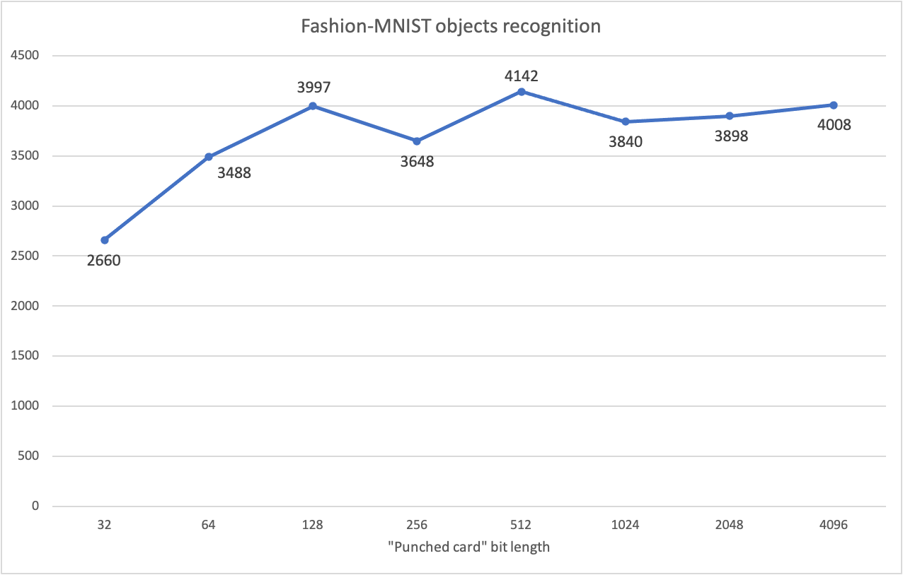

### 'Punched cards' proof of concept for Fashion-MNIST

*Object recognition by sparse random binary data lookup. Complementary code for [this article](https://petr-kovalev.medium.com/punched-cards-object-recognition-97523a98857b)*

Performing single-shot Fashion-MNIST objects recognition by lookup over the most different sparse input bit sets of the training data (out of 28⋅28⋅8=6272 bits per training sample)

Same algorithm applied to the QMNIST dataset [is here](https://github.com/Petr-Kovalev/punched-cards-qmnist-poc)

Results and program output are from [this code version](https://github.com/Petr-Kovalev/punched-cards-fashion-mnist-poc/tree/2df06be9f29b21fd2f9a574ea43e7c76233f5ab8)

### Best result chart:


### Interesting facts:
* Recognition accuracy on a best 512 bit punched card is 41.42%
* Punched cards per specific label in most cases works better or equal than one (global top) punched card
* Starting from bit length 32 there are cases when all the inputs per specific label of the punched card are unique
* Test set accuracy increasing almost linearly with the doubling of the punched card bit length up to 128. But after that no significant improvements (due to the lack of punched cards ranking algorithm except max distinct inputs count)

### Questions to answer:
* How to rank the punched cards when all the inputs per specific label are unique?
* How to make sure that chosen punched card is the best? Need to evaluate all of them?

### Ideas:
* It's possible to calculate the entropy of the inputs of the specific punched card per label (to rank them)
* Try calculate the relative importance of each bit of the punched card input (like attention mechanism). Use this metric for ranking.
* Build hierarchy of punched cards to perform lookup over the multiple punched card results instead of simple max. Interesting for small bit lengths but multiple punched cards.
* Prefer processing with less active bits on all stages (since electrical pulses in a brain requires energy)
* Encode (or map) the binary input somehow to have/keep the 2% sparsity (like in a brain)

### Program output:
```
Punched card bit length: 32

Global top punched card:
Unique input combinations per punched card (descending): {5998, 5998, 5998, 5991, 5981, 5975, 5775, 5761, 5567, 5279: sum 58323}: total sum 58323
Training results: 19179 correct recognitions of 60000
Test results: 3142 correct recognitions of 10000

Top punched cards per label:
Unique input combinations per punched card (descending): {5937, 5679: sum 11616}, {6000}, {6000}, {5999}, {5998}, {5996}, {5989}, {5988}, {5921}: total sum 59507
Training results: 15669 correct recognitions of 60000
Test results: 2660 correct recognitions of 10000

Punched card bit length: 64

Global top punched card:
Unique input combinations per punched card (descending): {6000, 6000, 6000, 6000, 6000, 6000, 6000, 6000, 5996, 5995: sum 59991}: total sum 59991
Training results: 18865 correct recognitions of 60000
Test results: 3095 correct recognitions of 10000

Top punched cards per label:
Unique input combinations per punched card (descending): {6000, 6000, 6000, 6000, 6000: sum 30000}, {6000, 6000: sum 12000}, {6000}, {6000}, {5996}: total sum 59996
Training results: 21222 correct recognitions of 60000
Test results: 3488 correct recognitions of 10000

Punched card bit length: 128

Global top punched card:
Unique input combinations per punched card (descending): {6000, 6000, 6000, 6000, 6000, 6000, 6000, 6000, 6000, 6000: sum 60000}: total sum 60000
Training results: 19557 correct recognitions of 60000
Test results: 3155 correct recognitions of 10000

Top punched cards per label:
Unique input combinations per punched card (descending): {6000, 6000, 6000, 6000, 6000, 6000, 6000, 6000, 6000: sum 54000}, {6000}: total sum 60000
Training results: 24812 correct recognitions of 60000
Test results: 3997 correct recognitions of 10000

Punched card bit length: 256

Global top punched card:
Unique input combinations per punched card (descending): {6000, 6000, 6000, 6000, 6000, 6000, 6000, 6000, 6000, 6000: sum 60000}: total sum 60000
Training results: 22350 correct recognitions of 60000
Test results: 3648 correct recognitions of 10000

Top punched cards per label:
Unique input combinations per punched card (descending): {6000, 6000, 6000, 6000, 6000, 6000, 6000, 6000, 6000, 6000: sum 60000}: total sum 60000
Training results: 22351 correct recognitions of 60000
Test results: 3648 correct recognitions of 10000

Punched card bit length: 512

Global top punched card:
Unique input combinations per punched card (descending): {6000, 6000, 6000, 6000, 6000, 6000, 6000, 6000, 6000, 6000: sum 60000}: total sum 60000
Training results: 25709 correct recognitions of 60000
Test results: 4142 correct recognitions of 10000

Top punched cards per label:
Unique input combinations per punched card (descending): {6000, 6000, 6000, 6000, 6000, 6000, 6000, 6000, 6000, 6000: sum 60000}: total sum 60000
Training results: 25709 correct recognitions of 60000
Test results: 4142 correct recognitions of 10000

Punched card bit length: 1024

Global top punched card:
Unique input combinations per punched card (descending): {6000, 6000, 6000, 6000, 6000, 6000, 6000, 6000, 6000, 6000: sum 60000}: total sum 60000
Training results: 23674 correct recognitions of 60000
Test results: 3840 correct recognitions of 10000

Top punched cards per label:
Unique input combinations per punched card (descending): {6000, 6000, 6000, 6000, 6000, 6000, 6000, 6000, 6000, 6000: sum 60000}: total sum 60000
Training results: 23674 correct recognitions of 60000
Test results: 3840 correct recognitions of 10000

Punched card bit length: 2048

Global top punched card:
Unique input combinations per punched card (descending): {6000, 6000, 6000, 6000, 6000, 6000, 6000, 6000, 6000, 6000: sum 60000}: total sum 60000
Training results: 24115 correct recognitions of 60000
Test results: 3898 correct recognitions of 10000

Top punched cards per label:
Unique input combinations per punched card (descending): {6000, 6000, 6000, 6000, 6000, 6000, 6000, 6000, 6000, 6000: sum 60000}: total sum 60000
Training results: 24115 correct recognitions of 60000
Test results: 3898 correct recognitions of 10000

Punched card bit length: 4096

Global top punched card:
Unique input combinations per punched card (descending): {6000, 6000, 6000, 6000, 6000, 6000, 6000, 6000, 6000, 6000: sum 60000}: total sum 60000
Training results: 24636 correct recognitions of 60000
Test results: 4008 correct recognitions of 10000

Top punched cards per label:
Unique input combinations per punched card (descending): {6000, 6000, 6000, 6000, 6000, 6000, 6000, 6000, 6000, 6000: sum 60000}: total sum 60000
Training results: 24636 correct recognitions of 60000
Test results: 4008 correct recognitions of 10000

Press "Enter" to exit the program...
```

### Update. Program output from [this code version](https://github.com/Petr-Kovalev/punched-cards-fashion-mnist-poc/tree/b6b3331c11d550f775657de00cde5a82068093cd):
```
Punched card bit length: 32

Global top punched card:
Unique input combinations per punched card (descending): {5998, 5998, 5998, 5991, 5981, 5975, 5775, 5761, 5567, 5279: sum 58323}: total sum 58323
Training results: 24310 correct recognitions of 60000
Test results: 3950 correct recognitions of 10000

Top punched cards per label:
Unique input combinations per punched card (descending): {5937, 5679: sum 11616}, {6000}, {6000}, {5999}, {5998}, {5996}, {5989}, {5988}, {5921}: total sum 59507
Training results: 16828 correct recognitions of 60000
Test results: 2877 correct recognitions of 10000

Punched card bit length: 64

Global top punched card:
Unique input combinations per punched card (descending): {6000, 6000, 6000, 6000, 6000, 6000, 6000, 6000, 5996, 5995: sum 59991}: total sum 59991
Training results: 28081 correct recognitions of 60000
Test results: 4550 correct recognitions of 10000

Top punched cards per label:
Unique input combinations per punched card (descending): {6000, 6000, 6000, 6000, 6000: sum 30000}, {6000, 6000: sum 12000}, {6000}, {6000}, {5996}: total sum 59996
Training results: 20891 correct recognitions of 60000
Test results: 3486 correct recognitions of 10000

Punched card bit length: 128

Global top punched card:
Unique input combinations per punched card (descending): {6000, 6000, 6000, 6000, 6000, 6000, 6000, 6000, 6000, 6000: sum 60000}: total sum 60000
Training results: 26741 correct recognitions of 60000
Test results: 4374 correct recognitions of 10000

Top punched cards per label:
Unique input combinations per punched card (descending): {6000, 6000, 6000, 6000, 6000, 6000, 6000, 6000, 6000: sum 54000}, {6000}: total sum 60000
Training results: 32154 correct recognitions of 60000
Test results: 5152 correct recognitions of 10000

Punched card bit length: 256

Global top punched card:
Unique input combinations per punched card (descending): {6000, 6000, 6000, 6000, 6000, 6000, 6000, 6000, 6000, 6000: sum 60000}: total sum 60000
Training results: 32076 correct recognitions of 60000
Test results: 5231 correct recognitions of 10000

Top punched cards per label:
Unique input combinations per punched card (descending): {6000, 6000, 6000, 6000, 6000, 6000, 6000, 6000, 6000, 6000: sum 60000}: total sum 60000
Training results: 32076 correct recognitions of 60000
Test results: 5231 correct recognitions of 10000

Punched card bit length: 512

Global top punched card:
Unique input combinations per punched card (descending): {6000, 6000, 6000, 6000, 6000, 6000, 6000, 6000, 6000, 6000: sum 60000}: total sum 60000
Training results: 34205 correct recognitions of 60000
Test results: 5591 correct recognitions of 10000

Top punched cards per label:
Unique input combinations per punched card (descending): {6000, 6000, 6000, 6000, 6000, 6000, 6000, 6000, 6000, 6000: sum 60000}: total sum 60000
Training results: 34205 correct recognitions of 60000
Test results: 5591 correct recognitions of 10000

Punched card bit length: 1024

Global top punched card:
Unique input combinations per punched card (descending): {6000, 6000, 6000, 6000, 6000, 6000, 6000, 6000, 6000, 6000: sum 60000}: total sum 60000
Training results: 33193 correct recognitions of 60000
Test results: 5418 correct recognitions of 10000

Top punched cards per label:
Unique input combinations per punched card (descending): {6000, 6000, 6000, 6000, 6000, 6000, 6000, 6000, 6000, 6000: sum 60000}: total sum 60000
Training results: 33193 correct recognitions of 60000
Test results: 5418 correct recognitions of 10000

Punched card bit length: 2048

Global top punched card:
Unique input combinations per punched card (descending): {6000, 6000, 6000, 6000, 6000, 6000, 6000, 6000, 6000, 6000: sum 60000}: total sum 60000
Training results: 33184 correct recognitions of 60000
Test results: 5378 correct recognitions of 10000

Top punched cards per label:
Unique input combinations per punched card (descending): {6000, 6000, 6000, 6000, 6000, 6000, 6000, 6000, 6000, 6000: sum 60000}: total sum 60000
Training results: 33184 correct recognitions of 60000
Test results: 5378 correct recognitions of 10000

Punched card bit length: 4096

Global top punched card:
Unique input combinations per punched card (descending): {6000, 6000, 6000, 6000, 6000, 6000, 6000, 6000, 6000, 6000: sum 60000}: total sum 60000
Training results: 33653 correct recognitions of 60000
Test results: 5476 correct recognitions of 10000

Top punched cards per label:
Unique input combinations per punched card (descending): {6000, 6000, 6000, 6000, 6000, 6000, 6000, 6000, 6000, 6000: sum 60000}: total sum 60000
Training results: 33653 correct recognitions of 60000
Test results: 5476 correct recognitions of 10000

Press "Enter" to exit the program...
```
